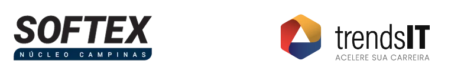

# BioLink Pro
Vitrine Digital | Programa Trends IT 2026

Olá, meu nome é Mario Henrique Gimenes Santana, sou de Guarujá/SP. Comecei minha carreira em Engenharia Mecânica pela Universidade Santa Cecília (UNISANTA) e hoje sou estudante de Ciência de Dados pela Universidade Virtual do Estado de São Paulo (UNIVESP), atualmente no terceiro semestre.

Durante minha graduação em engenharia mecânica tive um pouco de contato com noções de programação pelo matlab e com CLPs (Controlador lógico programável), dentro do que aprendi em especial gosto muito da parte de desenho 3D (CAD,CAE,CAM) e Impressão 3D.

Trabalhei por cerca de dois anos como freelancer na empresa americana Lionbridge, o que ajudou não só a me habituar com o trabalho home office mas também a desenvolver meu inglês pois toda a comunicação era feita nela.

Hoje, como estudante de Ciência de Dados pela Universidade Virtual do Estado de São Paulo (UNIVESP) e já formado em Tecnologia da Informação pela Univesp sigo na minha recolocação na área de tecnologia, onde possuo mais de 1 ano de experiência até o momento.

Este projeto é parte da primeira fase do programa Programa Trends IT 2026, oferecido pelo Núcleo Softex Campinas (NSC), parceiro da Univesp, o programa é uma iniciativa voltada à formação e capacitação de profissionais em tecnologias emergentes, visando a inovação digital e desenvolvimento de software. Ele tem como objetivo construir um cartão de visitas digital: uma landing page de links, pensada para funcionar com excelência no celular e desenhada para unir identidade visual, clareza de navegação e fundamentos sólidos de HTML e CSS.

Abaixo estão listados os artefatos gerados durante este desafio.

## Visão do Projeto

O **BioLink Pro** é uma vitrine digital desenvolvida para centralizar, em uma única página, os principais links, informações e destaques de uma pessoa, marca, profissional ou projeto. A solução resolve o problema de dispersão de conteúdo nas redes sociais e facilita o acesso rápido a perfis, portfólios, contatos e páginas externas importantes.

<details>
    <summary>Descrição(<i>clique para expandir</i>):</summary>
&nbsp;

## 1. Problema

Hoje, usuários que desejam divulgar sua presença digital frequentemente precisam compartilhar vários links separados em diferentes plataformas. Isso torna a navegação menos prática, reduz a organização da informação e dificulta que visitantes encontrem rapidamente o conteúdo mais relevante.

O BioLink Pro surge para oferecer uma apresentação unificada, visualmente atrativa e de fácil acesso, permitindo que o público encontre tudo em um só lugar.

## 2. Usuários-Alvo

O projeto é voltado principalmente para:

- Criadores de conteúdo
- Profissionais autônomos e freelancers
- Pequenos negócios e empreendedores
- Estudantes e desenvolvedores que desejam exibir portfólio
- Pessoas que querem reunir links pessoais e profissionais em uma página única

## 3. Objetivo Principal

O objetivo principal do BioLink Pro é fornecer uma página responsiva, organizada e moderna que funcione como ponto central da presença digital do usuário, reunindo links e informações essenciais de forma clara e acessível.

## 4. Principais Funcionalidades Esperadas

- Exibição de nome, foto ou avatar e breve apresentação
- Lista de links para redes sociais, portfólio, currículo ou contato
- Layout visual atraente e responsivo
- Organização clara das informações
- Navegação simples e intuitiva

## 5. Restrições de Tecnologia e Escopo

### Restrições tecnológicas
- O projeto será desenvolvido com **HTML5** e **CSS3**
- Não haverá dependência obrigatória de frameworks complexos
- O foco será em estrutura semântica, responsividade e boa apresentação visual

### Restrições de escopo
- O sistema terá foco em uma **página única**
- Não incluirá backend, banco de dados ou autenticação
- O objetivo não é criar uma rede social completa, mas sim uma vitrine digital funcional e elegante
- Recursos avançados, como edição dinâmica de conteúdo, podem ser deixados para versões futuras

</details>
&nbsp;

## Lista de Requisitos (Backlog Inicial)

A lista de requisitos, combinada com o Documento de Visão, cria o Plano de Projeto deste desafio.

<details>
    <summary>Descrição(<i>clique para expandir</i>):</summary>
&nbsp;

## 1. Requisitos Funcionais (RFs)

| ID   | Requisito                                                                 |
|------|-------------------------------------------------------------------------|
| RF01 | O sistema deve exibir o nome do usuário na página principal              |
| RF02 | O sistema deve exibir uma foto ou avatar do usuário                      |
| RF03 | O sistema deve exibir uma breve descrição ou bio do usuário              |
| RF04 | O sistema deve permitir a exibição de uma lista de links clicáveis       |
| RF05 | Cada link deve direcionar para uma página externa ao ser clicado         |
| RF06 | O sistema deve permitir adicionar ícones junto aos links                 |
| RF07 | O sistema deve organizar os links em uma estrutura visual clara          |
| RF08 | O sistema deve exibir feedback visual ao interagir com os links (hover)  |
| RF09 | O sistema deve permitir personalização básica de cores e estilo          |
| RF10 | O sistema deve ser acessível via navegador sem necessidade de login      |
| RF11 | O sistema deve carregar todo o conteúdo em uma única página (SPA simples)|

---

## 2. Requisitos Não Funcionais (RNFs)

| ID    | Requisito                                                                 |
|-------|-------------------------------------------------------------------------|
| RNF01 | A interface deve ser responsiva (adaptável a mobile, tablet e desktop)  |
| RNF02 | O carregamento da página deve ser rápido (baixo tempo de resposta)      |
| RNF03 | O código deve ser estruturado e organizado (HTML semântico e CSS limpo) |
| RNF04 | O sistema deve ter compatibilidade com navegadores modernos             |
| RNF05 | A interface deve ser intuitiva e de fácil navegação                      |
| RNF06 | O design deve ser visualmente agradável e consistente                   |
| RNF07 | O sistema deve seguir boas práticas de acessibilidade (cores, contraste)|
| RNF08 | O projeto deve ser leve, sem dependência de frameworks pesados          |
| RNF09 | O sistema deve funcionar mesmo com conexões de internet mais lentas     |
| RNF10 | O código deve ser facilmente manutenível e escalável                    |


</details>
&nbsp;

## BioLink Pro — Quadro de Tarefas (User Stories + Kanban)

As User Stories(US) ajudam a guiar o desenvolvimento de forma concisa de forma a construir um quadro Kanban que ajude a entender o que é esperado do projeto e as etapas para chegar ao entregável. Por ser uma ferramenta viva ele pode mudar/aumentar conforme o desenvolvimento, as stories iniciais servem para ajudar a guiar o desenvolvedor.

<details>
    <summary>Descrição(<i>clique para expandir</i>):</summary>
&nbsp;

## Histórias de Usuário (User Stories)

### US01 — Identidade do usuário
**História:**
Como um visitante, eu quero ver o nome e a foto do usuário, para que eu possa identificar de quem é a página.

**Tarefas técnicas:**
- Criar estrutura HTML para header
- Adicionar campo para nome
- Adicionar imagem/avatar
- Estilizar com CSS (centralização, tamanho, espaçamento)

---

### US02 — Biografia
**História:**
Como um visitante, eu quero ler uma breve descrição sobre o usuário, para entender quem ele é.

**Tarefas técnicas:**
- Criar seção de bio no HTML
- Estilizar texto (fonte, cor, alinhamento)
- Garantir boa legibilidade

---

### US03 — Lista de links
**História:**
Como um visitante, eu quero acessar links importantes em um só lugar, para navegar facilmente pelo conteúdo do usuário.

**Tarefas técnicas:**
- Criar lista de links no HTML
- Implementar tags `<a>`
- Garantir abertura correta dos links
- Criar espaçamento entre itens

---

### US04 — Interação com links
**História:**
Como um visitante, eu quero ter feedback visual ao interagir com os links, para saber que eles são clicáveis.

**Tarefas técnicas:**
- Implementar efeito `:hover` no CSS
- Adicionar transições suaves
- Testar comportamento em diferentes dispositivos

---

### US05 — Destaque de links importantes
**História:**
Como um visitante, eu quero ver links importantes destacados, para identificar rapidamente o conteúdo principal.

**Tarefas técnicas:**
- Criar classe CSS para destaque
- Aplicar estilo diferenciado (cor, borda ou tamanho)
- Testar contraste visual

---

### US06 — Ícones nos links
**História:**
Como um visitante, eu quero ver ícones nos links, para identificar rapidamente o tipo de conteúdo.

**Tarefas técnicas:**
- Escolher biblioteca de ícones (ou SVG)
- Inserir ícones no HTML
- Ajustar alinhamento com texto

---

### US07 — Layout responsivo
**História:**
Como um usuário mobile, eu quero acessar a página em qualquer dispositivo, para ter uma boa experiência independente da tela.

**Tarefas técnicas:**
- Implementar media queries no CSS
- Ajustar tamanhos de fonte e espaçamento
- Testar em diferentes resoluções

---

### US08 — Personalização visual
**História:**
Como um usuário dono da página, eu quero personalizar cores e estilo, para refletir minha identidade visual.

**Tarefas técnicas:**
- Criar variáveis CSS (`:root`)
- Definir esquema de cores
- Permitir fácil alteração de estilos

---

### US09 — Performance
**História:**
Como um visitante, eu quero que a página carregue rapidamente, para não perder tempo esperando.

**Tarefas técnicas:**
- Otimizar imagens
- Minimizar CSS
- Evitar dependências externas pesadas


</details>
&nbsp;


## Registro de Decisões Técnicas

Este documento registra as principais decisões técnicas tomadas durante o desenvolvimento do projeto, incluindo justificativas e referências utilizadas.

<details>
    <summary>Descrição(<i>clique para expandir</i>):</summary>
&nbsp;

## Decisão 01 — Uso de HTML5 e CSS3 puro

**Decisão:**  
Utilizar apenas HTML5 e CSS3, sem frameworks como React, Vue ou Bootstrap.

**Justificativa:**  
O objetivo do projeto é ser simples, leve e focado em fundamentos de frontend. Além disso, ele serve de fundação a nivel de iniciante, logo o uso de Frameworks nesse primeiro momento foge do objetivo de construir uma fundação em HTML e CSS

---

## Decisão 02 — Estrutura de página única (SPA simples)

**Decisão:**  
Criar uma aplicação de página única (Single Page Application simples), sem roteamento.

**Justificativa:**  
O BioLink Pro tem como objetivo centralizar informações em um único local. Não há necessidade de múltiplas páginas, o que simplifica a navegação e melhora a experiência do usuário.

**Referências:**
- Conceitos de SPA (Single Page Application)
- Análise do escopo do projeto
- Material de apoio 

---

## Decisão 03 — Uso de CSS com variáveis (:root)

**Decisão:**  
Utilizar variáveis CSS para controle de cores e estilos globais.

**Justificativa:**  
Facilita a manutenção, permite personalização rápida e melhora a organização do código.

**Referências:**
- MDN Web Docs — CSS Variables
- Testes práticos no projeto
- Aulas workover e IA

---

## Decisão 04 — Implementação de responsividade com Media Queries

**Decisão:**  
Garantir responsividade utilizando media queries no CSS.

**Justificativa:**  
Grande parte dos usuários acessa via dispositivos móveis. A responsividade é essencial para garantir boa usabilidade em diferentes telas.


**Referências:**
- Princípios de Mobile First Design
- MDN Web Docs — Media Queries

---

## Decisão 05 — Uso de ícones via SVG ou biblioteca leve

**Decisão:**  
Utilizar ícones em SVG ou bibliotecas leves (ex: ícones inline).

**Justificativa:**  
SVGs são leves, escaláveis e não impactam significativamente o desempenho. Foram utilizados ícones do site fontawesome.com

---

## Decisão 06 — Sem backend ou banco de dados

**Decisão:**  
Não utilizar backend nem banco de dados nesta versão.

**Justificativa:**  
Requisito de projeto, o foco é frontend e apresentação visual. Isso reduz complexidade e mantém o escopo adequado para a fase atual.

---

## Decisão 07 — Organização semântica do HTML

**Decisão:**  
Utilizar tags semânticas como `<header>`, `<main>`, `<footer>`.

**Justificativa:**  
Melhora acessibilidade, SEO e organização do código.

**Referências:**
- HTML5 Semantic Elements — MDN


</details>
&nbsp;

## O projeto

A versão final conta com uma interface com cor gradiente de azul para branco. O HTML em si é um card com as informações pessoais ao topo, seguido de botões de links e embaixo, quatro opções de links rápidos com ícones svg.

Já o CSS contém toda a estilização, com definição do que cada bloco de código faz.

O projeto segue todos os requisitos e restrições cobrados:

<details>
    <summary>Descrição(<i>clique para expandir</i>):</summary>
&nbsp;

### Requisitos funcionais

- A página deve conter foto de perfil circular, nome, bio e pelo menos 4 botões de links
- Os botões devem ter interatividade visual, mudando de estilo — cor, sombra ou escala — quando o mouse passar sobre eles
- A página deve possuir responsividade obrigatória, ajustando-se automaticamente a qualquer tamanho de tela, sem quebra de layout nem barra de rolagem horizontal no celular
- Deve haver acessibilidade básica, com uso de atributo alt em imagens e nomes descritivos nos links Requisitos técnicos
- É obrigatório o uso de HTML5 semântico, com tags como header, main, footer e a 
- Toda a estilização deve estar em um arquivo CSS externo, mantendo o HTML limpo
- O alinhamento dos elementos deve ser feito obrigatoriamente com Flexbox
- O projeto final deve estar disponível por meio de uma URL pública, como no GitHub Pages

### Restrições

- Frameworks são proibidos: não é permitido usar Bootstrap, Tailwind ou qualquer biblioteca CSS pronta. O objetivo é consolidar o CSS Vanilla
- Ferramentas low-code são proibidas: o uso de Canva para exportação de código, Wix ou similares é terminantemente proibido
- Sem JavaScript nesta fase: o projeto deve ser puramente estático, com HTML e CSS
- Sem tabelas para layout: utilizar `table` para organizar a tela é uma prática obsoleta e proibida neste projeto

</details>
&nbsp;

Além disso foram implementados alguns dos itens opcionais exemplificados no guia do projeto.

- Animações com CSS: Fade e float foram adicionados para torna o site levementa mais vivo
- Dark Mode nativo: Modo escuro nativo implementado
- Cartão de contato (VCard): opção para rapidamente salvar contato pelo arquivo contato.vcf
- Formato Landscape: Ao colocar o celular na horizontal a tela se ajusta para o modo landscape


## Como visualizar online

O projeto está hospedado no GitHub Pages:

https://mhsantana.github.io/BioLinkPro/

## Como executar localmente

### Opção 1 — Abrindo direto no navegador
1. Baixe ou clone este repositório.
```bash
git clone https://github.com/MHsantana/BioLinkPro.git
```
2. Abra o arquivo `index.html` no navegador.

### Opção 2 — Usando Live Server no VS Code
1. Abra o projeto no VS Code.
2. Instale a extensão **Live Server**, se ainda não tiver.
3. Clique com o botão direito no `index.html`.
4. Selecione **Open with Live Server**.